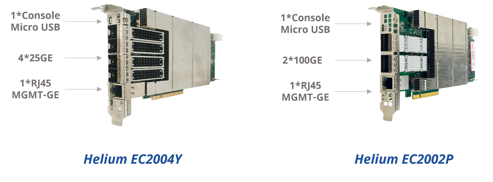
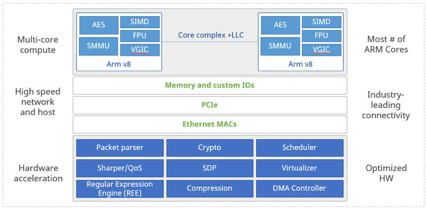

English  |  [简体中文](./README.md) 

- [ET2500 Product](./ET2500/README.en.md)
- [Overview](#intro)
- [Features](#features)
- [Application Scenario](#scene)
- [Hardware Specification](#spec)
  - [Panel](#panel)
  - [Architecture](#framework)
  - [Specification](#hardware)
- [Contents](#dir)
- [Quickly Start](#quickuse)
- [How to Contribute](#contribute)
- [Contact](#contact)


<a id="intro"></a>
# Overview
Helium SmartNIC adopts high-performance DPU architecture design and provides fully open software development environment, which can offload and accelerate processing of virtual networks and virtual network functions that customers originally run on x86 servers in scenarios such as cloud data centers, HPC and edge computing, providing customers a higher performance experience while reducing total cost of ownership.
Take NFV offloading as an example：


| Product | Performance | Latency | Connection Per Second|Power Consumption|Cost|
|----|---|--|--|--|--|
|2U Server（2 x Intel Xeon Gold 5118 24 Cores）|60Gbps|200us|120.000|350W|X|
|Helium DPU SNIC 24 Cores |60Gbps|100us|150.000|60W|0.5X|
 
From the above data, it can be found that the power consumption of the Helium SmartNIC is only 1/6 of that of the server, and the purchase cost is saved by more than 1/2, while providing lower forwarding delay and higher number of new flow sessions. Of course, this is the data obtained from the test of a single NFV business dimension. If we start from the dimension of the overall construction plan of cloud services, what will be the result?
Take cloud gateway access as an example：


|Environment|Devices|Rack Space|Power Consumption|Connection per 1U|Cost|
|--|--|--|--|--|--|
|1.44Tbps|24 x 2U Server|48U，two 42U standard cabinet|8400W|6000|Y|
|1.44Tbps|3 x 4U Server，24 x Helium DPU，1 x Switch|14U，half of 42U standard cabinet|3390W|20000|0.5Y|
 
Under the premise of ensuring the total number of access users, the solution of introducing Helium SmartNIC has obvious advantages in terms of rack space occupation, total power consumption, and cost compared with the solution of pure 2U servers. The rack space is saved by more than 2/3, the total power consumption is saved by more than 1/2, and the construction cost is saved by 1/2 dollars. Moreover, the average number of users connected to 1U of the rack is increased by more than 3 times.
In addition, Helium SmartNIC also provides rich application scenario verification (such as OVS, 5G UPF, DPVS, IPsec, SSL), ensuring high-reliability and high-performance for business. 
Adhering to the concept of open network, Asterfusion opens product information and code to all customers, and sincerely invites everyone to jointly build the DPU product ecosystem. 


<a id="features"></a>
# Features
- 4 x SFP28 or 2 x QSFP28, meet 100Gbps typical traffic processing capacity
- 24-core ARMv8 processor, integrated encryption and decryption, compression and decompression, virtualization, data packet processing, traffic shaping co-processing engine
- Optimized DPDK and VPP
- Support Debian/Ubuntu/Centos
- Support docker
- Large Capacity ACL & Connection Tables: support over 10 million concurrent sessions with maximum 64GB memory
- PCIe x16 Gen3.0/Gen4.0，support PCIe online upgrade
- 1GbE out-of-band management port
- 1GbE in-band management port

<a id="scene"></a>
# Application Scenario
- Network acceleration: 
  - OVS offload
  - OVS offload + 3rd-Party Applications
  - VxLAN (VTEP) offload
  - TCP/UDP offload
  - Gateway NFV (vFW/vLB/vNAT/vR) offload
- Storage acceleration: 
  - NVMeoF (TCP) Offload
  - Compression and decompression Offload
- Security acceleration: 
  - Inline IPsec
  - SSL/TLS Offload
  - eBPF Offload
- User-Defined Scenario


<a id="spec"></a>
# Hardware Specification

<a id="panel"></a>
## Panel
  

<a id="framework"></a>
## Architecture
 
 
<a id="hardware"></a>
## Specification

| Category | Helium EC2004Y | Helium EC2002P |
|-----------|----------------|----------------|
| Network interfaces     |  4 x 25GE SFP28| 2 x 100GE QSFP28|
|Host interface | PCIe x8 Gen3.0/Gen4.0 |PCIe x8 Gen3.0/Gen4.0 |
|Management interface| 1 x Console Micro USB，1*GE RJ45 OOB port | 1 x Console Micro USB，1*GE RJ45 OOB port |
|Power consumption|60W|60W|
|Dimension (W x H x D, mm)|111.15 x 18.91 x 178.48|111.15 x 18.91 x 194.35|
|Weight (kg)|0.8|0.8|
|Operating temperature| 0~35℃ | 0~35℃|
|Operating humidity|10%~90% (non-condensing)| 10%~90% (non-condensing)|
|DPU model| Marvell CN9670, 24-cores ARM64, 1.8GHz | Marvell CN9670, 24-cores ARM64, 1.8GHz |
|Memory capacity|	16GB DDR4, maximum 64GB|16GB DDR4, maximum 64GB|
|Flash storage|	64GB EMMC 5.1|64GB EMMC 5.1|

<a id="dir"></a>
# Contents
```js
|-- Boards  //Helium Hardware Architecture
    |-- EC2004Y
    |-- EC2002P
|-- Doc  //Helium Manual
    |-- User Manual
|-- Host //Host Codes
|-- Helium //Helium Codes
    |-- DPDK
    |-- VPP
    |-- OvS
    |-- UPF
    |-- DPVS
    |-- Kernel
    |-- Toolchain
|-- READMD.md
```

<a id="quickuse"></a>
# Quickly Start
- [User Manual](Doc/User%20Manual/Helium%20DPU%20User%20Manual.pdf)

<a id="contribute"></a>
# How to Contribute
Asterfusion welcomes customers, developers, and researchers to contribute in a variety of ways, including but not limited to:
- Submit Issue: If you have any questions about the use of Helium SNIC, you can submit an issue to the community, including but not limited to usage questions, bugs, feature requirements, etc.
- Technical discussion: Discuss DPU related application scenarios and solutions with DPU R&D members in real time through email, communication group, online meeting, etc.


<a id="contact"></a>
# Contact
- Chinese Homepage: https://asterfusion.com/
- Global homepage: https://cloudswit.ch
- WeChat Official Account: Asterfusion
- Phone Number: +86-400-098-9811
- Pre-sales: sales@asterfusion.com
- After-sales: support@asterfusion.com
