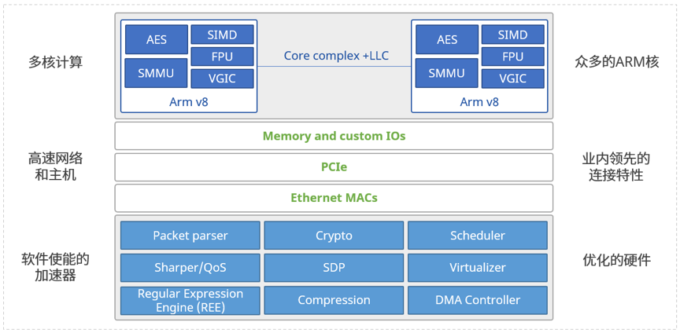

[English](./README.en.md)  |  简体中文  

- [Helium DPU 概览](#intro)
- [产品特性](#features)
- [应用场景](#scene)
- [产品规格](#spec)
  - [硬件面板图](#panel)
  - [硬件架构](#framework)
  - [硬件规格](#hardware)
- [目录结构](#dir)
- [快速使用](#quickuse)
- [如何贡献](#contribute)
- [联系我们](#contact)


<a id="intro"></a>
# Helium DPU 概览
Helium智能网卡采用高性能DPU架构设计，提供全开放的软件开发环境，可针对云数据中心、HPC、边缘计算等场景中客户原本跑在x86服务器上的的虚拟网络和虚拟网络功能进行卸载和加速处理，为客户提供更高性能体验的同时降低总体拥有成本。
以NFV（如vFW）为例：

| 产品 | 处理性能 | 转发时延 | 每秒新建流数|功耗|成本|
|----|---|--|--|--|--|
|2U机架式服务器（2* Intel Xeon Gold 5118 24核）|60Gbps|200us|12万|350W|>3万|
|Helium智能网卡 24核|60Gbps|100us|15万|60W|<2万|
 
通过以上数据可以发现，在提供了更低转发时延和更高流新建会话数的情况下，Helium智能网卡的功耗仅为服务器的1/6，购买成本节省超过1/3。当然这是从单个NFV业务维度测试得出的数据，如果我们从云服务整体建设方案维度出发又是什么结果呢？
以接入网关为例：

|接入环境|设备配置|机架空间|总功耗|平均每U接入用户数|成本|
|--|--|--|--|--|--|
|1.44Tbps|24*2U服务器|48U，2个42U标准机柜|8400W|6000|72万|
|1.44Tbps|3*4U服务器，24\*Helium智能网卡，1\*交换机|14U，半个42U标准机柜|3390W|20000|64万|
 
在保证总接入用户数量的前提下，引入Helium智能网卡的建设方案相对于纯2U服务器的建设方案在机架空间占用、总功耗、成本上都具有明显优势。其中*机架空间节省超过2/3，总功耗节省超过1/2，建设成本节省8W，同时机架平均每U接入的用户数有3倍以上的提升*。
此外，Helium智能网卡还提供了广泛的应用场景验证（如OVS、5G UPF、DPVS、IPSec、SSL），充分保证了业务的可靠性和性能。秉承开放网络的理念，Asterfusion将产品资料和代码开源给各位客户，诚邀大家共同打造智能网卡行业生态，在享受先进技术的同时真正满足自主可控的需求。

<a id="features"></a>
# 产品特性
- 4\*SFP28接口或2\*QSFP28接口，满足100Gbps典型混合业务处理场景
- 24核DPU处理器，集成加解密、压缩解压缩、虚拟化、数据包处理、流量整形协处理引擎
- 支持DPDK、VPP开发套件
- 支持Debian/Ubuntu/Centos操作系统
- 支持容器虚拟化环境，方便应用程序部署和移植；
- 内存大小配置可选（8GB/16GB/32GB），最大配置为64GB，提供大容量状态表和ACL表，满足千万级会话表
- 提供PCIe*16 Gen3.0/Gen4.0，支持PCIe在线升级
- 提供独立的外置管理网口，以及内置管理网口，组网和管理更加便捷和可靠

<a id="scene"></a>
# 应用场景
- 网络加速：OVS卸载/VXLAN终结、TCP卸载、GRE/GTP隧道封装/解封装、可靠UDP、5G UPF等
- 存储加速：NVMe-oF（TCP）、压缩/解压缩等
- 安全加速：IPSec、SSL、XDP/eBPF、vFW/vLB/vNAT、DPI、DDoS防御等
- 其他个性化应用的开发和移植

<a id="spec"></a>
# 产品规格

<a id="panel"></a>
## 硬件面板图
  

<a id="framework"></a>
## 硬件架构
 
 
<a id="hardware"></a>
## 硬件规格

| 网卡型号 | Helium EC2004Y | Helium EC2002P |
|-----------|----------------|----------------|
| 网络接口     |  4*25GE SFP28| 2*100GE QSFP28|
|主机接口 | PCIe*8 Gen3.0/Gen4.0 |PCIe*16 Gen3.0/Gen4.0 |
|管理口| 1\*Console Micro USB，1*GE RJ45管理网口 | 1\*Console Micro USB，1*GE RJ45管理网口 |
|功耗|60W|60W|
|外形尺寸（W\*H*D）|111.15mm\*21.8mm*167.65mm|111.15mm\*21.8mm*184.16mm|
|重量|0.8kg|0.8kg|
|工作环境-温度| 0~35℃ | 0~35℃|
|工作环境-湿度|10%~90%（非凝结）| 10%~90%（非凝结）|
|业务CPU型号| CN96XX | CN96XX |
|业务CPU核心数量| 24 | 24 |
|业务CPU主频|1.8GHz |1.8GHz|
|业务CPU物理数量| 1 | 1 |
|业务CPU L2 Cache | L2 5MB, L3 14MB |L2 5MB, L3 14MB|
|可配置内存容量|单条内存8GB、16GB或32GB，可配置最多2条|单条内存8GB、16GB或32GB，可配置最多2条|
|内存规格（DDR3，DDR4）|	DDR4 ECC SODIMM|DDR4 ECC SODIMM|
|内存可扩展最大容量|	64GB| 64GB|
|Flash存储|	64GB EMMC 5.1|64GB EMMC 5.1|

<a id="dir"></a>
# 目录结构
```js
|-- Boards  //Helium智能网卡硬件架构
    |-- EC2004Y
    |-- EC2002P
|-- Doc  //Helium智能网卡相关手册
    |-- User Manual
|-- Host //主机侧驱动等相关代码
|-- Helium //网卡侧代码
    |-- DPDK
    |-- VPP
    |-- OvS
    |-- UPF
    |-- DPVS
    |-- Kernel
    |-- Toolchain
|-- READMD.md //本文档
```

<a id="quickuse"></a>
# 快速使用
- [用户手册](Doc/User%20Manual/Helium%20DPU%20%E7%94%A8%E6%88%B7%E6%89%8B%E5%86%8C.pdf)

<a id="contribute"></a>
# 如何贡献
Asterfusion欢迎客户、开发者和研究人员以各种方式参与贡献，包括但不限于：
- 提交Issue：如果您对Helium智能网卡使用有任何问题，可以向社区提交ISSUE，包括不限于使用疑问、BUG、特性需求等等。
- 技术讨论：通过邮件、交流群、在线会议等方式，与DPU研发成员实时讨论DPU相关应用场景及解决方案等。

<a id="contact"></a>
# 联系我们
- Asterfusion官网：https://asterfusion.com/
- 微信公众号：星融元Asterfusion
- 联系方式：400-098-9811
- 售前：sales@asterfusion.com
- 售后：support@asterfusion.com
